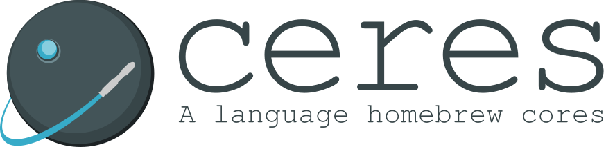

    

    
    
    

---
## Development

**Ceres is not done yet, please refer to [Homemade Bread](https://github.com/GustavoAle/ceres-lang/tree/homemade-bread) as the development branch**

## Brief
Ceres is a semi-oop simple programming language targeting newborn RISC
processors.  
It's main goal is to avoid the use of assembly and machine code during the
development and testing of the S3MC processors. This goal will be gradually
extended to provide a high-level language for newborn RISC processors since LLVM
and other compiler toolchains are relatively hard to work with.

## Documentation
### Usage, syntax and language related info.
Please refer to [Ceres Documentation](https://gustavoale.github.io/ceres-lang-doc/site/)
for documentation, examples and further information.

### New ports
How to port to a new architecture?  
I'm working on a guide on how to add a new port, since Ceres is built on that premise.

---
## Author

* Author: Gustavo Ale
* GitHub: https://github.com/GustavoAle
* Email: gustavo.engca@gmail.com

## Credits

* Tom Niemann - [Lex & Yacc tutorial](https://www.epaperpress.com/lexandyacc/).
The first versions of the lexer and parser are strongly based on Niemann's
examples presented in the book.
